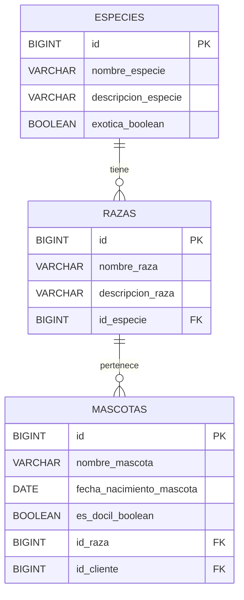

#  Pets Microservice (pets-api v1)

## Descripción

Microservicio encargado de la **gestión de mascotas** dentro del ecosistema de VetDistribuidora SPA. Permite registrar mascotas, consultar por ID o listar todas, asociándolas a su raza y especie correspondiente. Mantiene referencia al cliente dueño mediante comunicación con el microservicio de usuarios vía WebClient.

Este microservicio forma parte de una arquitectura distribuida para la transformación digital de VetDistribuidora SPA.

## Tech Stack

### Infraestructura:

- [Java 25 LTS](https://docs.oracle.com/en/java/javase/25/): Última versión Java
  Long Term Support.
- [Spring Boot v4.0.6](https://github.com/spring-projects/spring-boot): Última
  versión estable.
- [Docker](https://docs.docker.com/) &
  [Docker Compose](https://docs.docker.com/compose/): Contenedorización y
  entorno de desarrollo.
- [MySQL v8.4 LTS](https://hub.docker.com/_/mysql): Base de datos relacional.

### Dependencias:

1. **Lombok:** Reducción de boilerplate (getters, setters, constructores)
2. **Validation:** Validación de beans con Jakarta
3. **Spring Boot DevTools:** Autoreload y mejoras de desarrollo
4. **Spring WebMVC:** Capacidades REST para controladores MVC
5. **Spring WebFlux:** WebClient para comunicación inter-microservicios
6. **Spring Data JPA:** ORM para manejo de entidades
7. **MySQL Connector:** Driver de conexión a la base de datos
8. **Flyway Migration:** Migraciones versionadas de base de datos
9. **Spotless (Palantir):** Autoformateador de código

##  Modelo de Datos

### Diagrama Entidad-Relación



> [!NOTE]
> El campo `id_cliente` en `mascotas` referencia un usuario del
> **microservicio de Usuarios** (comunicación vía WebClient). No existe FK
> local.

### Entidades

| Entidad   | Tabla      | Descripción                                                      |
| --------- | ---------- | ---------------------------------------------------------------- |
| `Especie` | `especies` | Catálogo de especies (Perro, Gato, Exóticos, etc.)               |
| `Raza`    | `razas`    | Catálogo de razas asociadas a una especie (Bulldog, Siamés, etc.)|
| `Mascota` | `mascotas` | Registro de mascotas con su raza, datos y dueño                  |

## Estructura del Proyecto

```
src/main/java/cl/duoc/api_mascotas/
├── ApiMascotasApplication.java        # Clase principal
├── client/
│   └── UsuarioClient.java             # WebClient al microservicio de usuarios
├── config/
│   └── UsuarioWebClientConfig.java    # Configuración del WebClient
├── controller/
│   └── MascotaController.java         # Endpoints REST
├── dto/
│   ├── request/
│   │   └── MascotaRequestDTO.java     # DTO de entrada
│   └── response/
│       ├── MascotaResponseDTO.java    # DTO de salida principal
│       ├── RazaResponseDTO.java       # DTO anidado de raza
│       ├── EspecieResponseDTO.java    # DTO anidado de especie
│       └── UsuarioResponseDTO.java    # DTO del cliente/dueño
├── exception/                         # Manejo de excepciones (WIP)
├── model/
│   ├── Especie.java                   # Entidad JPA
│   ├── Raza.java                      # Entidad JPA
│   └── Mascota.java                   # Entidad JPA principal
├── repository/
│   ├── EspecieRepository.java
│   ├── RazaRepository.java
│   └── MascotaRepository.java
└── service/
    └── MascotaService.java            # Lógica de negocio y mapeo DTO
```

##  API / Endpoints

Base URL: `/api/v1/mascotas`

| Acción            | Método | Endpoint                | Estado   |
| ----------------- | ------ | ----------------------- | -------- |
| Registrar mascota | POST   | `/api/v1/mascotas`      | ✅ Listo |
| Consultar por ID  | GET    | `/api/v1/mascotas/{id}` | ✅ Listo |
| Listar todas      | GET    | `/api/v1/mascotas`      | ✅ Listo |
| Eliminar por ID   | DELETE | `/api/v1/mascotas/{id}` | 🚧 WIP  |

### Ejemplo de Request (POST `/api/v1/mascotas`)

```json
{
  "nombreMascota": "Pello",
  "fechaNacimientoMascota": "2023-05-15",
  "esDocilBoolean": true,
  "idRaza": 5,
  "idCliente": 1
}
```

### Ejemplo de Response

```json
{
  "id": 1,
  "nombreMascota": "Pello",
  "fechaNacimientoMascota": "2023-05-15",
  "esDocilBoolean": true,
  "razaResponse": {
    "id": 5,
    "nombreRaza": "Bulldog",
    "descripcionRaza": "Complexión robusta y compacta originaria del Reino Unido.",
    "especieResponse": {
      "id": 1,
      "nombreEspecie": "Perro",
      "descripcionEspecie": "Mamífero carnívoro subespecie del lobo...",
      "exoticaBoolean": false
    }
  },
  "idCliente": 1
}
```

##  Migraciones Flyway

Las migraciones se encuentran en `src/main/resources/db/migration/`:

| Archivo                                  | Descripción                                    |
| ---------------------------------------- | ---------------------------------------------- |
| `V1__create_tables.sql`                  | Creación de tablas: especies, razas, mascotas  |
| `V2__insert_catalogo_gatos.sql`          | Catálogo de especies y razas de gatos          |
| `V3__insert_catalogo_perros.sql`         | Catálogo de especies y razas de perros         |
| `V4__insert_catalogo_exoticos.sql`       | Catálogo de especies y razas exóticas          |
| `V5__insert_catalogo_otros_domesticos.sql` | Catálogo de otros animales domésticos        |

## Entorno de Desarrollo

### 1. Configurar variables de entorno

Crear un archivo `.env` a partir del ejemplo proporcionado:

```bash
cp .env.example .env
```

Variables principales del `.env`:

```yaml
SPRING_ENV=dev
SPRING_APP_NAME=PetsMicroservice
HOST_PORT=8082
HOST_DB_PORT=3306
MYSQL_DATABASE=pets
MYSQL_HOST=localhost
MYSQL_USER=user
MYSQL_PASSWORD=password
MYSQL_ROOT_PASSWORD=root_password
PHPMYADMIN_PORT=8088
```

### 2. Levantar la base de datos

```bash
docker compose up -d
```

### 3. Verificar BD vía phpMyAdmin

- Ir a [http://localhost:8088](http://localhost:8088)
- Usar las credenciales definidas en `.env`. Por defecto:
  - **User:** `user`
  - **Password:** `password`

### 4. Ejecutar la aplicación

```bash
./mvnw spring-boot:run
```

La API estará disponible en `http://localhost:8082/api/v1/mascotas`

### Perfiles de configuración

| Perfil     | Archivo                         | Uso                          |
| ---------- | ------------------------------- | ---------------------------- |
| `dev`      | `application-dev.properties`    | Desarrollo local con Docker  |
| `devlocal` | `application-devlocal.properties` | Desarrollo local alternativo |
| `prod`     | `application-prod.properties`   | Producción                   |
| `test`     | `application-test.properties`   | Testing                      |

## 🔀 Git & Workflow

- **Branch `dev`:** Todo el desarrollo va aquí.
- **Branch `main`:** Solo código listo para producción.
- Commits siguen
  [Conventional Commits](https://www.conventionalcommits.org/en/v1.0.0/):

  ```
  feat(MascotaService): add pet registration logic
  fix(MascotaController): handle null raza validation
  ```

##  Equipo

- Eduardo Bray
- Rodrigo Callealta
- Fernando Villalobos

##  Microservicio Desarrollado Por Rodrigo Callealta

- user github = lironscallealta


> **DuocUC — FullStack 1 © 2026**

---
